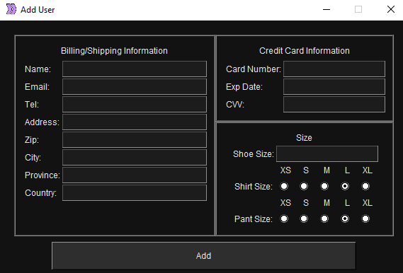

# HyperShopper

Companies such as Supreme use a limited supply to create demand and urge customers to buy their products and this exclusivity plays a significant role in Supreme's success. In fact, popular items on Supreme usually sell out in under ten seconds! HyperShopper is a software application programmed to buy products as soon as they are released. Currently, HyperShopper supports Supreme.com and Nike's sneaker app, SNKRS. 

## Screen Shots
Shown below is the HyperShopper's UI. On the left, the user is able to create/remove a user profile and view information about a particular profile. In the middle, the user is able to enter a product link along with the intended purchase time. On the right, the user is able to see all requests that are in progress and also cancel any requests if required. 

Below is the UI for creating a new user profile.

## Installation and Setup Instructions

Clone down this repository. You will need ChromeDriver installed globally on your machine. ChromeDriver: https://chromedriver.chromium.org/downloads

### External Python Libraries
* selenium
* PIL
* datetime

To start HyperShopper:
run `shopper.py`

## Reflection
HyperShopper is a rapid purchasing program that was implemented over the span of a few weeks. The project goals include improving my knowledge of Python, while on creating a clear and aesthetic user interface. 

Originally, my idea was to have a single user place a single request. However, after realizing the market demand for multiple users placing requests at the same time, I took a multi-threaded approach and created a new thread for each new request. Currently, HyperBot can process four requests at the same time and hold a maximum of four user profiles. The number four was chosen as beyond this, performance is greatly affected. 

One of the main challenges I faced while implementing HyperShopper was implementing an aesthetic GUI. This was challenging as I didn't have much experience with Tkinter before this project. As was one of the main focuses of this project, I took several days to learn about Tkinter and spent around a week to design and implement the GUI, while going through many design iterations.

In the future, I could add support for more websites such as Foot Locker and Champs. In addition, currently, the user is expected to complete any CAPTCHA the bot encounters. In the future, support can be added to automate the CAPTCHA solving as much as possible.  

By the end of this project, I had a much better grasp of Tkinter and had improved my general Python coding skills. I also learned about how Selenium works and I plan to use it to test my future web applications. 

